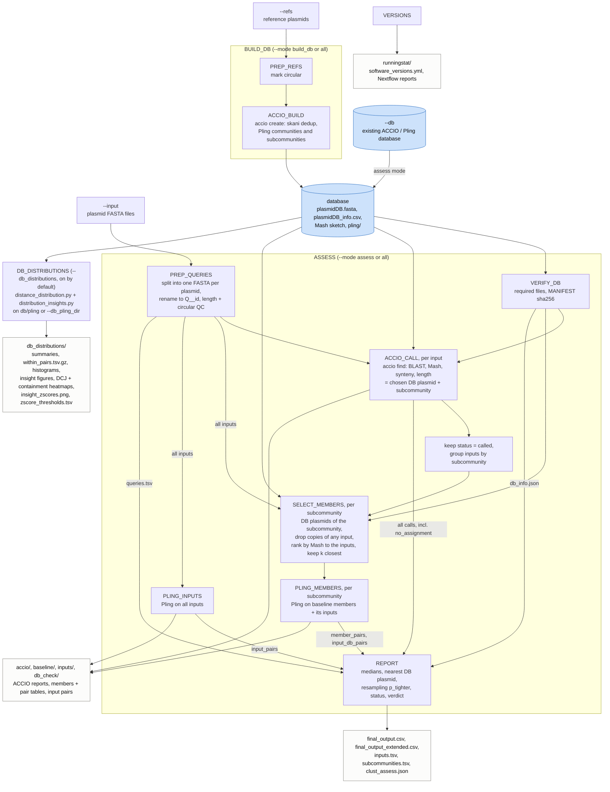
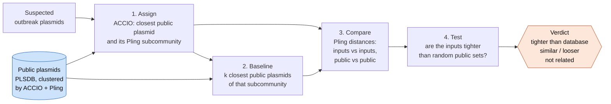

```mermaid
flowchart TB
    %% ---------------- inputs ----------------
    IN["--input<br/>plasmid FASTA files"]
    REFS["--refs<br/>reference plasmids"]
    DBIN[("--db<br/>existing ACCIO / Pling database")]

    %% ---------------- BUILD_DB ----------------
    subgraph BUILD["BUILD_DB (--mode build_db or all)"]
        PR["PREP_REFS<br/>mark circular"] --> AB["ACCIO_BUILD<br/>accio create: skani dedup,<br/>Pling communities and subcommunities"]
    end
    REFS --> PR
    AB --> DB[("database<br/>plasmidDB.fasta, plasmidDB_info.csv,<br/>Mash sketch, pling/")]
    DBIN -- "assess mode" --> DB

    %% ---------------- ASSESS ----------------
    subgraph ASSESS["ASSESS (--mode assess or all)"]
        PQ["PREP_QUERIES<br/>split into one FASTA per plasmid,<br/>rename to Q__id, length + circular QC"]
        VD["VERIFY_DB<br/>required files, MANIFEST sha256"]
        AC["ACCIO_CALL, per input<br/>accio find: BLAST, Mash, synteny, length<br/>= chosen DB plasmid + subcommunity"]
        GRP["keep status = called,<br/>group inputs by subcommunity"]
        SM["SELECT_MEMBERS, per subcommunity<br/>DB plasmids of the subcommunity,<br/>drop copies of any input,<br/>rank by Mash to the inputs, keep k closest"]
        PM["PLING_MEMBERS, per subcommunity<br/>Pling on baseline members + its inputs"]
        PI["PLING_INPUTS<br/>Pling on all inputs"]
        RE["REPORT<br/>medians, nearest DB plasmid,<br/>resampling p_tighter, status, verdict"]

        PQ --> AC
        VD --> AC
        AC --> GRP --> SM --> PM
        VD --> SM
        PQ -- "all inputs" --> SM
        PQ -- "all inputs" --> PI
        AC -- "all calls, incl. no_assignment" --> RE
        PM -- "member_pairs, input_db_pairs" --> RE
        PI -- "input_pairs" --> RE
        PQ -- "queries.tsv" --> RE
        VD -- "db_info.json" --> RE
    end
    IN --> PQ
    DB --> VD
    DB --> AC
    DB --> SM

    %% ---------------- every mode ----------------
    DD["DB_DISTRIBUTIONS (--db_distributions, on by default)<br/>distance_distribution.py + distribution_insights.py<br/>on db/pling or --db_pling_dir"]
    VER["VERSIONS"]
    DB --> DD

    %% ---------------- published results ----------------
    OUT["final_output.csv, final_output_extended.csv,<br/>inputs.tsv, subcommunities.tsv, clust_assess.json"]
    MID["accio/, baseline/, inputs/, db_check/<br/>ACCIO reports, members + pair tables, input pairs"]
    ODD["db_distributions/<br/>summaries, within_pairs.tsv.gz, histograms,<br/>insight figures, DCJ + containment heatmaps,<br/>insight_zscores.png, zscore_thresholds.tsv"]
    OV["runningstat/<br/>software_versions.yml, Nextflow reports"]
    RE --> OUT
    AC --> MID
    PM --> MID
    PI --> MID
    DD --> ODD
    VER --> OV

    classDef store fill:#cde2fb,stroke:#256abf,color:#0b0b0b
    classDef out fill:#fcfcfb,stroke:#898781,color:#0b0b0b
    class DB,DBIN store
    class OUT,MID,ODD,OV out
```
# clust-assess in one picture

```mermaid
flowchart LR
    IN["Suspected<br/>outbreak plasmids"] --> A["1. Assign<br/>ACCIO: closest public plasmid<br/>and its Pling subcommunity"]
    DB[("Public plasmids<br/>PLSDB, clustered<br/>by ACCIO + Pling")] --> A
    A --> B["2. Baseline<br/>k closest public plasmids<br/>of that subcommunity"]
    DB --> B
    A --> C["3. Compare<br/>Pling distances:<br/>inputs vs inputs,<br/>public vs public"]
    B --> C
    C --> T["4. Test<br/>are the inputs tighter<br/>than random public sets?"]
    T --> V{{"Verdict<br/>tighter than database<br/>similar / looser<br/>not related"}}

    classDef store fill:#cde2fb,stroke:#256abf,color:#0b0b0b
    classDef verdict fill:#fde6da,stroke:#c4501f,color:#0b0b0b
    class DB store
    class V verdict
```

